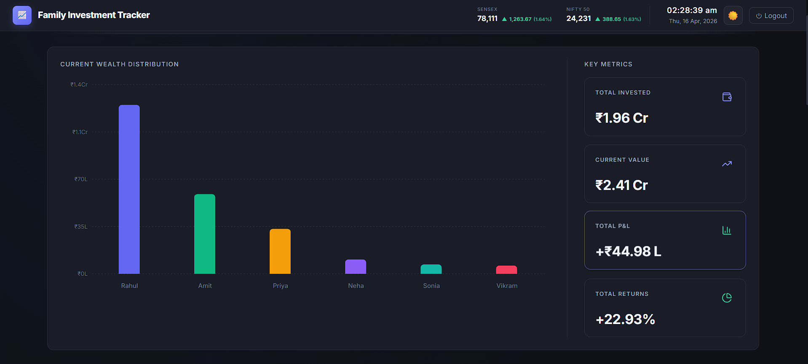

# 📈 Family Investment Tracker

> A production-grade portfolio management dashboard built for a real client — this is the public demo version.

[


## 🔐 Try the Live Demo


| Field    | Value                    |
|----------|--------------------------|
| Email    | `Demo@gmail.com`  |
| Password | `1234`              |



---

## 💡 About This Project

This is a **demo version** of a fully custom investment tracking dashboard originally built for a private family office client. It manages a multi-member family portfolio across 8 asset classes, with live market data pulled in real time.

The client needed a single place to:
- Track all investments across family members and asset types
- See live P&L with real-time market prices
- Monitor advisor-wise performance
- Export data for CA/tax filing

This demo uses anonymised sample data (32+ dummy investments) to showcase the full feature set.

---

## ✨ Features

### 📊 Multi-Asset Portfolio Tracking
Supports **8 investment types** in a single unified dashboard:
- Stocks (NSE/BSE listed)
- Mutual Funds
- Bonds
- Insurance
- Fixed Deposits (FDs)
- Unlisted Stocks
- Capital in LLPs
- Loans to LLPs & Companies

### 📈 Live Market Data
- **Real-time stock prices** via Yahoo Finance API
- **Live Mutual Fund NAVs** via mfapi.in
- Automatic P&L calculation (invested vs. current value)

### 👨‍👩‍👧‍👦 Family Member Filtering
- 6 family member profiles
- Filter the entire dashboard by individual member
- Aggregated family-wide view

### 🧑‍💼 Advisor Tracking
- Investments tagged by financial advisor
- P&L summary broken down per advisor
- Useful for performance reviews

### 🌙 UI/UX
- Light / Dark mode with preference persistence
- Responsive design (desktop + mobile)
- CSV export for filtered portfolio data

### 🔒 Authentication
- Secure login via Supabase Auth (email + password)
- Admin-only access control

---

## 🛠 Tech Stack

| Layer        | Technology                          |
|--------------|-------------------------------------|
| Frontend     | Next.js 16, TypeScript, Tailwind CSS |
| Auth & DB    | Supabase (PostgreSQL + Auth)        |
| Charts       | Recharts                            |
| Market Data  | Yahoo Finance, mfapi.in             |
| Icons        | Lucide React                        |
| Deployment   | Vercel                              |

---

## 🚀 Run It Yourself

### Prerequisites
- Node.js 18+
- A free [Supabase](https://supabase.com) account

### 1. Clone the repo
```bash
git clone https://github.com/9599602428sid-lgtm/demo-investment-tracker.git
cd demo-investment-tracker
```

### 2. Set up Supabase
- Go to [supabase.com](https://supabase.com) → New Project
- In the SQL Editor, run the contents of `supabase-setup.sql` — this creates all tables and seeds 32+ dummy investments
- Copy your **Project URL** and **Anon Key** from Settings → API

### 3. Create a demo user
- Go to Authentication → Users → Add User
- Email: `demo@sharmafinance.in` | Password: `Demo@1234`

### 4. Configure environment
```bash
cp .env.local.example .env.local
# Add your Supabase URL and Anon Key
```

### 5. Install and run
```bash
npm install
npm run dev
```

### 6. Deploy to Vercel
```bash
# Push to GitHub, then import in Vercel dashboard
# Add these env vars in Vercel:
# NEXT_PUBLIC_SUPABASE_URL
# NEXT_PUBLIC_SUPABASE_ANON_KEY
```

---

## 📁 Project Structure

```
├── supabase-setup.sql     # DB schema + seed data
├── seed-db.js             # Script to populate sample investments
├── .env.local.example     # Environment variable template
├── next.config.ts
└── src/
    ├── app/               # Next.js App Router pages
    ├── components/        # UI components (charts, tables, filters)
    └── lib/               # Supabase client, data fetching utils
```

---

## 🤝 Need Something Similar?

This was built as a custom solution for a client. If you're looking for a similar dashboard — a portfolio tracker, fintech tool, or data-heavy internal app — feel free to reach out.

📧 **9599602428sid@gmail.com**
💼 **www.linkedin.com/in/siddhant-suri-856a75315**

---

## 📄 License

This demo is open-sourced for portfolio purposes. The underlying codebase for the original client project is private.
